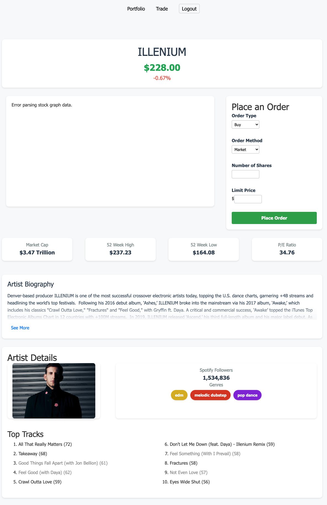

# MusicMarket - Artist Stock Trading Platform

MusicMarket is an **idea** of a software trading platform that simulates a stock market for music artists. Users can buy and sell shares of their favorite artists, track their portfolio, and stay updated on artist performance.

## Technologies Used

- Backend: Django (Python)
- Frontend: HTML, CSS, JavaScript
- Database: SQLite (default Django database)
- APIs: Last.fm (for artist information), yfinance (for stock data simulation), Spotipy (for music data)
- Charts: Chart.js

## Project Structure

- `myproject/`: Main Django project directory
  - `main1/`: Main application directory
    - `static/`: Static files (CSS, JavaScript, images)
    - `templates/`: HTML templates
    - `views.py`: View functions
    - `models.py`: Database models
    - `urls.py`: URL configurations
  - `register/`: User registration and authentication app
- `manage.py`: Django management script

## Contributing

I am not a software engineer, so this project may be buggy and not fully functional. That said, contributions are welcome! Please feel free to submit a Pull Request.

## License

This project is licensed under the MIT License.
